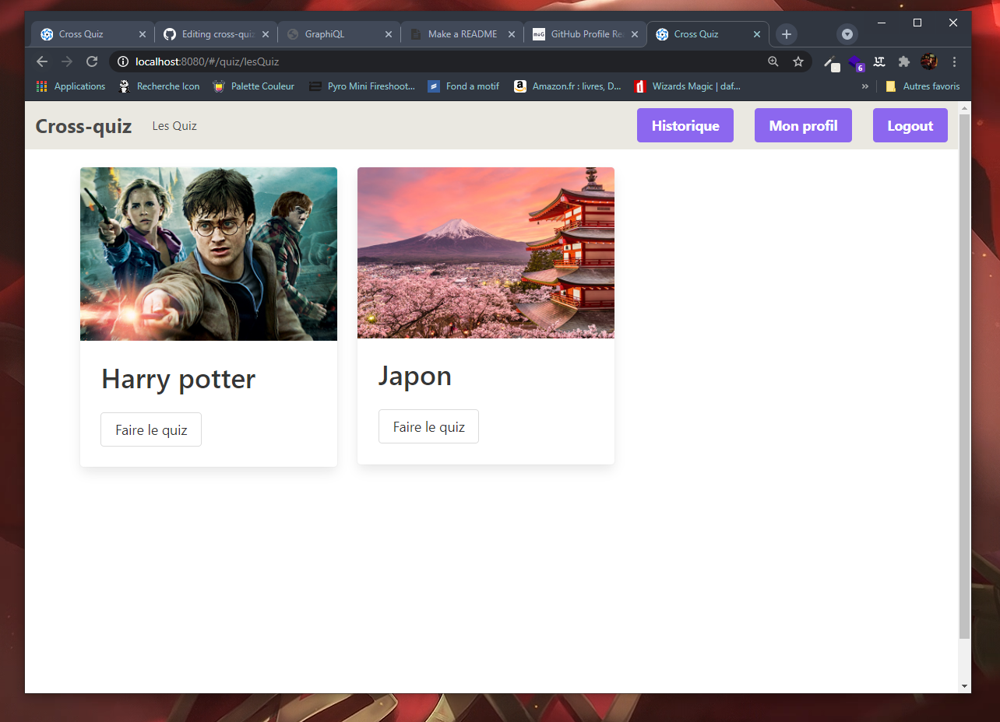
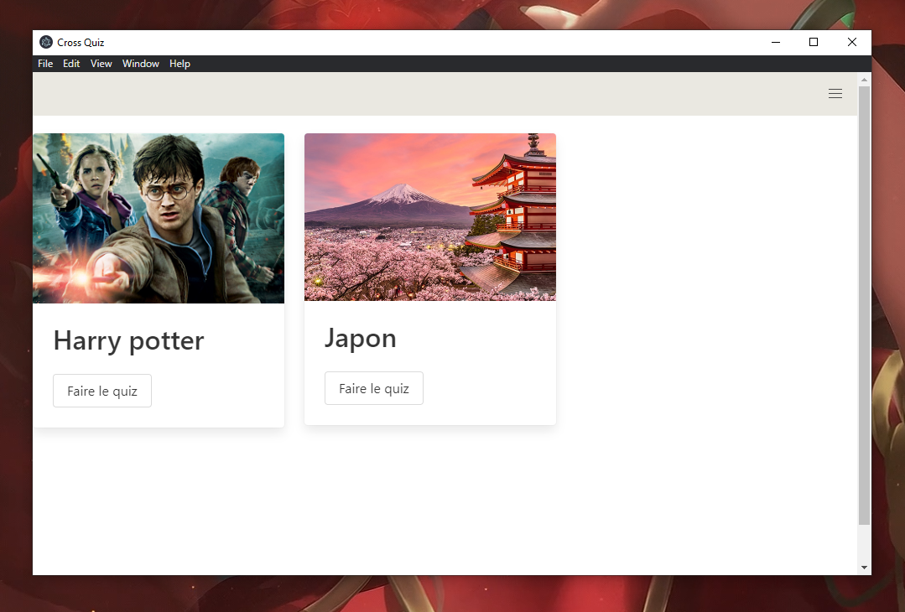
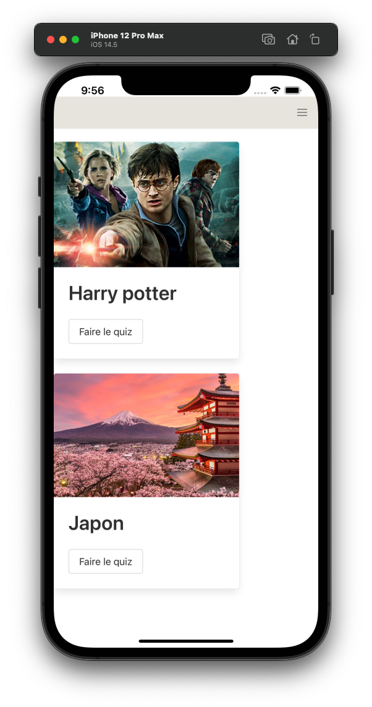

# Cross-quizz

The project is about a simple Quiz App but not so easy ; A user can practice and test å knowledge by answering questions in a specific domain using quiz application.

## Installation Back

```bash
cd /Back 
yarn install 
npx prisma migrate dev
yarn dev
```
## Installation Front

```bash
cd /Front
yarn install 
```
###### Start the app browser in development mode

```bash
yarn dev
```

###### Start the app electron in development mode

```bash
yarn electron
```

###### Start the app mobile(ios) in development mode

```bash
yarn ios
```

###### Start the app mobile(android) in development mode

```bash
yarn android
```

## Screen
<p align="center">
  
</p>
<p align="center">
  
</p>
<p align="center">
  
</p>
<p align="center">
  
</p>
                                          

